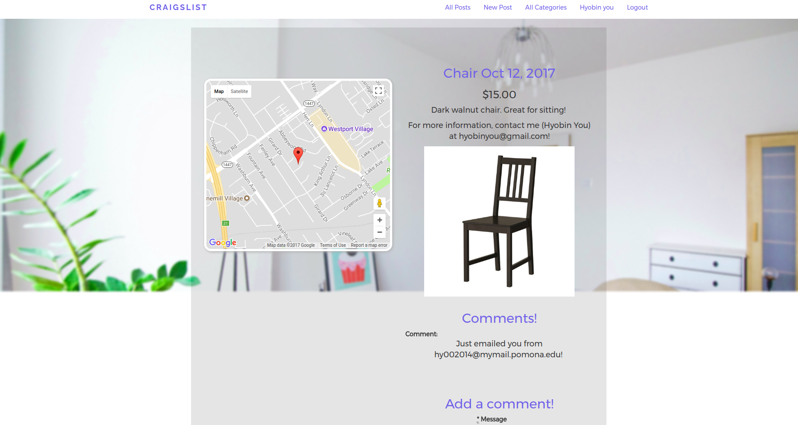

5C-Craigslist
=================
Summary
-------
Among the five colleges that compose the Claremont Colleges, many students utilize various facebook groups and other communication platforms (such as campus-wide emails) to sell dorm room items, ranging from furniture to class books. Much waste is generated as these various platforms are not accessible to every student, and the difficulty of scheduling actual transitions prevent students from selling their items and rather ends up in the garbage disposal. This web app allows Claremont College students to better connect with each other.

APIs/Gems:
-------
1. Image uploading using <a href="https://github.com/thoughtbot/paperclip">paperclip</a> gem
2. <a href="https://github.com/thoughtbot/paperclip#image-processor">ImageMagick</a>, which is required for Paperclip.
3. <a href="https://developers.google.com/maps/web/">Google Maps API</a> with the <a href="https://github.com/alexreisner/geocoder"> geocoder</a> gem
4. <a href= "https://www.ckeditor.com">CKEditor</a> text editor which allows users to style their post listings.
5. <a href="https://github.com/laserlemon/figaro">Figaro</a> for hiding API keys
6. Bootstrap grids for making the website responsive
7. <a href="https://github.com/slack-ruby/slack-ruby-client">Slack API</a>/Incoming Webhook 

System Configurations:
-------
Rails 5 (5.0.1)

Ruby 2.4 (2.4.2p198)

Last tested on Ubuntu (16.04 LTS) on Chrome (Version 61.0.3163.100).

User Stories
-------
1. Users can login, logout and create an account.
2. Users can view all posts without logging in.
3. Users can view all posts within a category without loggin in.
4. Users can post a listing if logged in.
5. Users can upload an image and address to their post if logged in.
6. Users can edit/update their post if logged in.
7. Users can view all posts made by self. 
8. Users can sort postings by cost (organized by descending post time by default).
9. Users can comment on a posting. 
10. Users can only register if a Claremont Colleges student. 
11. Users can receive Slack notification for each new post made. (Refer to "Notes" for integration instructions.)





Installation Instructions
-------
To view locally, clone the repo, install and create the database.
```
git clone https://github.com/justinhyou/5C-Craigslist
cd 5C-Craigslist
bundle install
```

If you don't have imagemagick on your computer, install it.
```
mac - brew install imagemagick
```

Then, start the server.
```
be rails s
```

Go to following address on a web browser. 
```
localhost:3000
```

Notes
-------

Ongoing Improvements to be Implemented
1. Users can post comments with automatically attached username.
2. Users can view profiles of other users, which contains their posts. 
3. Users can use in-app Venmo/Paypal.
4. Users can filter based on cost ranges, date ranges, and locations. 
5. Users can navigate all pages with customized favicon.
6. Users can edit/delete their own comments. 
7. Users can automatically archive their sold items.  

Slack Integration
1. Create a channel in Slack group
2. Create a New Bot Integration and note its API token
3. Add API token to secrets.yml
4. Uncomment code in posts_controller.rb
[More details](https://github.com/slack-ruby/slack-ruby-client)

Contact
-------
(Justin) Hyobin You at hyobinyou@gmail.com.


References 
-------
https://developers.braintreepayments.com/guides/venmo/server-side/ruby

https://github.com/RailsApps/rails-stripe-checkout

http://www.hongkiat.com/blog/send-messages-to-slack/

http://teejayvanslyke.com/use-slack-incoming-webhooks-from-rails.html

https://github.com/jawt94/Craigslist